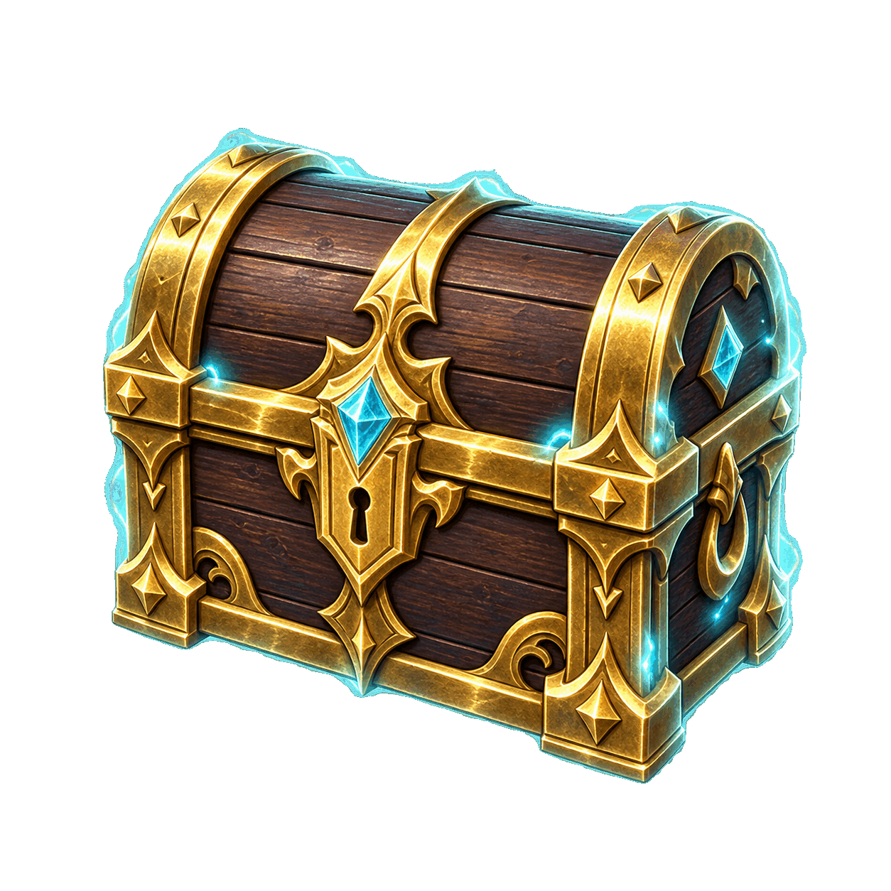
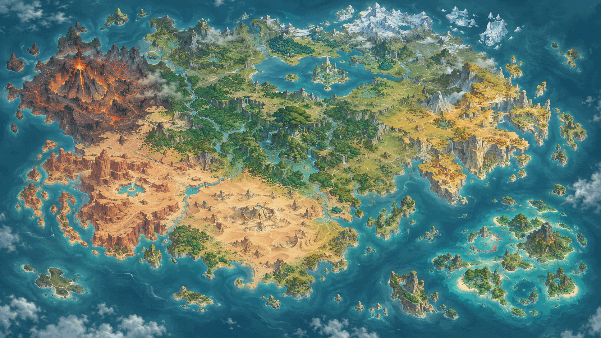
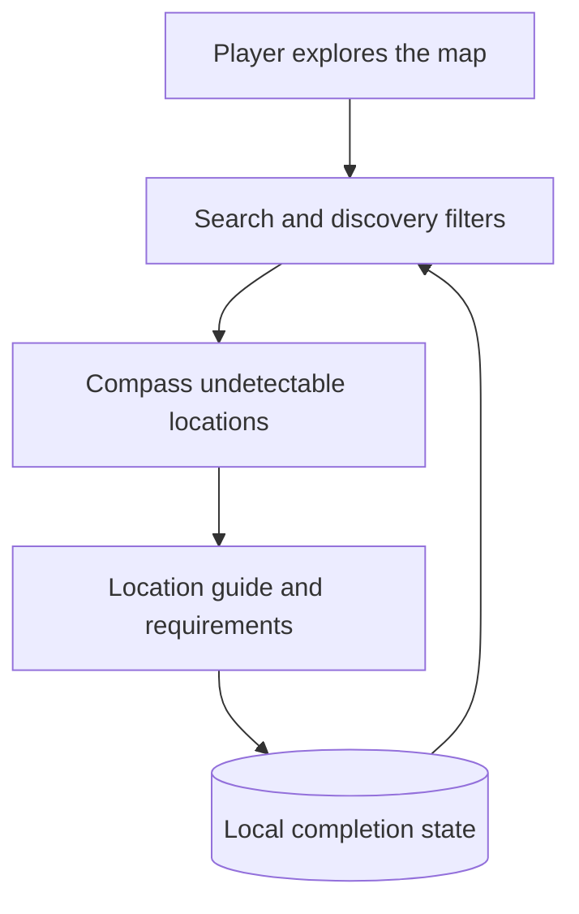

<div align="center">



# Hidden Chest Atlas

### A focused Genshin Impact tracker for the treasures your compass cannot find

Explore a Teyvat inspired map, filter compass undetectable discoveries, open location guides, and keep track of every chest you find.

<br />

[](https://hidden-chest-atlas.shaqib-dev.chatgpt.site)
[](https://react.dev/)
[](https://www.typescriptlang.org/)
[](https://workers.cloudflare.com/)

<br />

[Live demo](https://hidden-chest-atlas.shaqib-dev.chatgpt.site) · [Features](#features) · [How it works](#how-it-works) · [Quick start](#quick-start) · [Roadmap](#roadmap)

</div>

---

## Find what the Treasure Compass misses

The in game Treasure Compass is useful, but it does not reveal every reward in Teyvat. Buried chests, quest rewards, hidden challenges, Seelie encounters, and puzzle based discoveries can still be easy to overlook.

Hidden Chest Atlas gives those locations a dedicated home. Instead of filling the screen with every visible chest, it focuses on discoveries that need context, instructions, or manual investigation.

> **Honest tracking by design:** HoYoLAB exposes aggregate chest totals, not the exact coordinates of chests a player has opened. Hidden Chest Atlas therefore uses manual completion tracking and never claims to identify individual in game discoveries automatically.

## Product preview

<a href="https://hidden-chest-atlas.shaqib-dev.chatgpt.site">
  
</a>

<div align="center">
  <sub>Illustrated Teyvat style world map with rarity coded treasure markers</sub>
</div>

## Features

<table>
  <tr>
    <td width="33%" valign="top"><h3>🧭 Hidden discovery focus</h3>Filters around buried rewards, puzzles, quests, challenges, Seelie encounters, and other compass undetectable finds.</td>
    <td width="33%" valign="top"><h3>🗺️ Teyvat style map</h3>Places recognizable treasure markers over an illustrated world map with clear region and location context.</td>
    <td width="33%" valign="top"><h3>✅ Local progress</h3>Lets players mark locations as found and saves completion state directly on the device.</td>
  </tr>
  <tr>
    <td width="33%" valign="top"><h3>🔎 Fast filtering</h3>Search by location, filter by region or discovery method, and hide locations already completed.</td>
    <td width="33%" valign="top"><h3>💎 Rarity markers</h3>Distinguishes Common, Exquisite, Precious, Luxurious, and Remarkable rewards with visible colors.</td>
    <td width="33%" valign="top"><h3>📖 Practical guides</h3>Shows the area, discovery method, difficulty, reward estimate, and instructions for every location.</td>
  </tr>
</table>

## How it works



### Discovery categories

| Category | Hidden mode | Why |
| --- | :---: | --- |
| Directly visible standard chests | No | These are generally discoverable with the Treasure Compass. |
| Buried or dig locations | Yes | They require interacting with a specific ground location. |
| Quest unlocked chests | Yes | They depend on quest progress or a scripted event. |
| Timed challenges | Yes | The reward appears only after completing the challenge. |
| Puzzle rewards | Yes | The chest is created or unlocked by solving an environmental puzzle. |
| Remarkable chests | Yes | These are useful to track separately for furnishing collectors. |
| Seelie encounters | Case by case | Compass behavior can vary, so locations should be verified individually. |

## Current prototype

The deployed experience currently includes:

* Nine representative locations across Natlan, Fontaine, Liyue, and Mondstadt
* Region, discovery type, text search, and completion filters
* Five chest rarity styles
* Individual discovery instructions and reward estimates
* Device based progress persistence
* Responsive desktop and mobile layouts
* An app tool for marking known chest IDs as found

The current data is representative product data, not yet a complete verified catalog. Expanding and validating the dataset is the project’s next major phase.

## Technical architecture

| Layer | Technology | Responsibility |
| --- | --- | --- |
| **Interface** | React 19 and TypeScript | Map experience, filters, markers, guides, and progress controls |
| **Framework** | Vinext and Vite | Application routing, development, and production builds |
| **Visual system** | CSS and Lucide icons | Responsive layout, styling, and interface iconography |
| **Progress storage** | Browser LocalStorage | Device based manual completion tracking |
| **Deployment** | Cloudflare Workers compatible build | Hosted application delivery |
| **Future persistence** | Drizzle ORM and Cloudflare D1 | Optional account progress and curated location data |

### Repository map

```text
.
├── app/
│   ├── page.tsx                 Map data, filters, markers, and tracking
│   ├── globals.css              Responsive visual system
│   └── layout.tsx               Application shell and metadata
├── public/
│   ├── teyvat-world-map.png     Illustrated map artwork
│   └── treasure-chest.png       Treasure marker artwork
├── components/ui/               Reusable interface primitives
├── db/                          Optional Drizzle and D1 foundation
├── scripts/                     Development and build helpers
└── vite.config.ts               Vinext and Cloudflare configuration
```

## Quick start

### Prerequisites

* Node.js 22.13 or newer
* pnpm 11 or newer

### Run locally

```bash
git clone https://github.com/Skeeb32/Genshin-Interactive-Hidden-Chest-Map.git
cd Genshin-Interactive-Hidden-Chest-Map
pnpm install
pnpm dev
```

Open the local address printed in the terminal. The default portable development port is `5173`.

### Build and validate

```bash
pnpm lint
pnpm build
pnpm start
```

## API reality

HoYoLAB game records can expose aggregate statistics such as total Common, Exquisite, Precious, and Luxurious chests opened. They do not expose a coordinate level list of which specific chests a player has collected.

| Possible | Not currently possible |
| --- | --- |
| Display aggregate account statistics | Identify every opened chest by map coordinate |
| Save manual progress locally or to an account | Automatically reconcile a player’s exact chest history |
| Estimate overall exploration progress | Reliably infer which individual marker should be completed |

Any future HoYoLAB integration should preserve this distinction in both the interface and documentation.

## Roadmap

1. Replace representative locations with a verified community sourced dataset.
2. Add true map pan, zoom, clustering, and regional layers with MapLibre or Leaflet.
3. Add guide screenshots, quest prerequisites, nearby waypoints, and source attribution.
4. Support account based progress while keeping LocalStorage as a private default.
5. Add import and export tools for progress backups.
6. Add optional HoYoLAB aggregate statistics without implying exact chest synchronization.
7. Add automated tests for filtering, completion state, and responsive interactions.

## Contributing

Verified location contributions are welcome. A useful submission should include the exact region, chest rarity, discovery type, coordinates, reproduction steps, prerequisites, and evidence that the Treasure Compass cannot reveal the reward.

Please avoid submitting unverified coordinates or copying proprietary map assets from another service.

## Disclaimer

Hidden Chest Atlas is an independent fan project. It is not affiliated with or endorsed by HoYoverse. Genshin Impact, HoYoLAB, and related names and assets belong to their respective owners.

The included map and marker artwork are original project assets created for this experience.

---

<div align="center">

### Built by Shaqib Habib

A focused exploration tool built around transparent data limits, practical player workflows, and a polished map experience.

[Explore the live project](https://hidden-chest-atlas.shaqib-dev.chatgpt.site)

<sub>All rights reserved © Shaqib Habib</sub>

</div>
